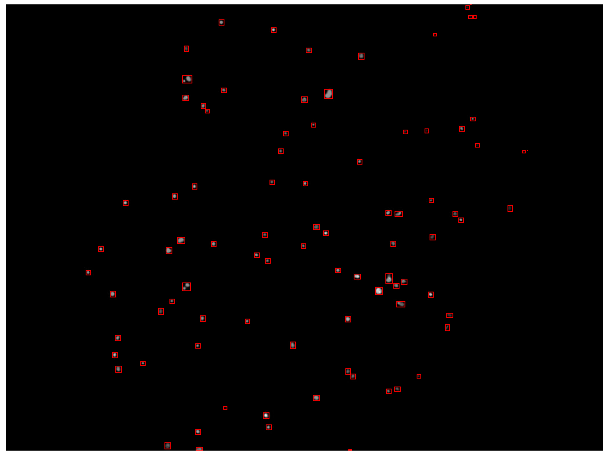

# AutoSedia


A command-line tool to automate data ingestion, processing, segmentation, and plotting workflows for dual-image single cell image datasets.

---

## Table of Contents

1. [Features](#features)  
2. [Prerequisites](#prerequisites)  
3. [Installation](#installation)   
4. [Usage](#usage)  
5. [Examples](#examples)  
6. [License](#license)  
7. [Contact](#contact)

---

## Features

- **Automated workflows**: chain data loading, preprocessing, segmentation, analysis, and plotting in a single command.  
- **Built-in plotting**: common scientific plots (histograms) with matplotlib defaults.
- **Overlay Formation**: overlays created for visual verification

---

## Prerequisites

- **Python** 3.11.7  
- Unix-like shell (macOS, Linux) or Windows with WSL
- `git` (for cloning)

---

## Installation

There are two ways to easily install. If you are familiar with the UNIX environment, Poetry, and Python, then simple create your virtual environment with Python3.11.7 and use 'poetry install' once you cd to directory housing the .toml file. All dependencies with be installed automatically. 

If you are not familiar with such things, then the easiest way to install this software is to clone the directory (on download the zip and unzip in) and then open a terminal in autosedia directory containing the setup_autosedia.sh and run_autosedia.sh scripts. Then at the terminal window, type:
```bash
chmod +x ./setup_autosedia.sh
```
to allow excute permissions of the scripts. Then at the terminal type:
```bash
./setup_autosedia.sh 
```
The script will install the required version of Python, venv, create a virtual environment, and install all dependencies.

## Usage

First, make sure your your raw images are in .tiff format and named mask01.tiff, target01.tiff, etc at that you insert them into the 'RawImages' directory located in the 'data' directory.

 Then, if you are familiar with Python,  you can run the software in your virtual environment using:
```bash
python ./autosedia.py
```
If you are not familiar with Python, then open a terminal in the autosedia directory containing the setup_autosedia.sh and run_autosedia.sh scripts. Then at the terminal window, type:
```bash
chmod +x ./run_autosedia.sh
```
then
```bash
./run_autosedia.sh
```
The script will automatically open the virtual environment, run the script, then deactivate the virtual environment.

All output data is located in the 'output' directory.

## Examples
**Mask Overlay**

**Taget Overlay**

**Combined Overlay


## License

## Contact
Contact me on my discord: FAFnineDEr1d3R

